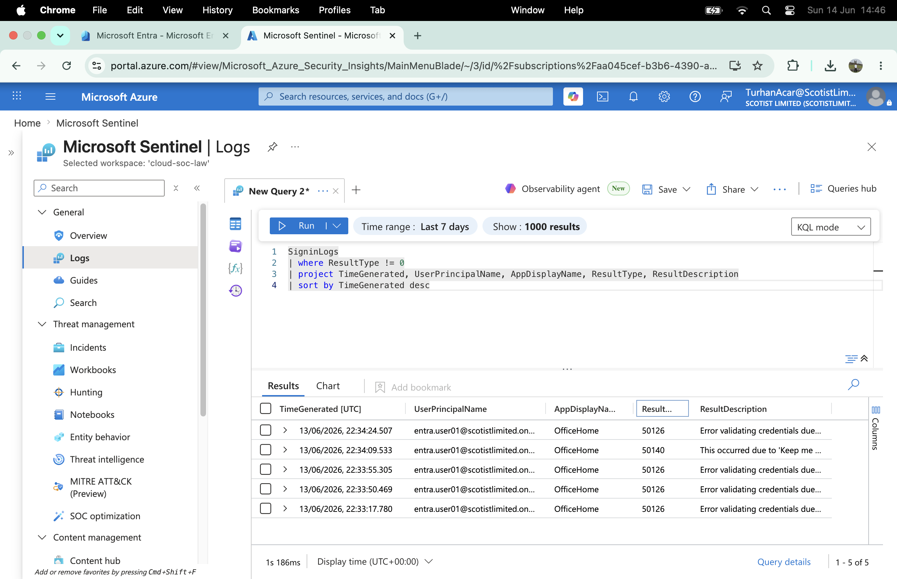

# Failed Authentication Investigation

## Objective

Investigate failed authentication activity in Microsoft Entra ID using Microsoft Sentinel.

## Scenario

Multiple failed authentication attempts were generated against a cloud identity account to validate Microsoft Sentinel visibility and detection capabilities.

## Data Sources

* Microsoft Entra ID
* Microsoft Sentinel
* SigninLogs

## Evidence



### User

```text
entra.user01@scotistlimited.onmicrosoft.com
```

### Application

```text
OfficeHome
```

### Result Type

```text
50126
```

### Description

```text
Invalid username or password
```

## KQL Query

```kql
SigninLogs
| where ResultType != 0
| project TimeGenerated,
          UserPrincipalName,
          AppDisplayName,
          ResultType,
          ResultDescription
| sort by TimeGenerated desc
```

## Findings

Microsoft Sentinel successfully detected multiple failed authentication attempts against a cloud identity account.

The activity was visible through the SigninLogs table and identified using KQL hunting queries.

## MITRE ATT&CK Mapping

### T1110 - Brute Force

Attackers may attempt to gain access by repeatedly trying invalid credentials.

## Analyst Assessment

The activity was generated during a controlled lab exercise.

No malicious activity was identified.

## Outcome

* SigninLogs ingestion validated
* Failed authentication monitoring validated
* Microsoft Sentinel detection validated
