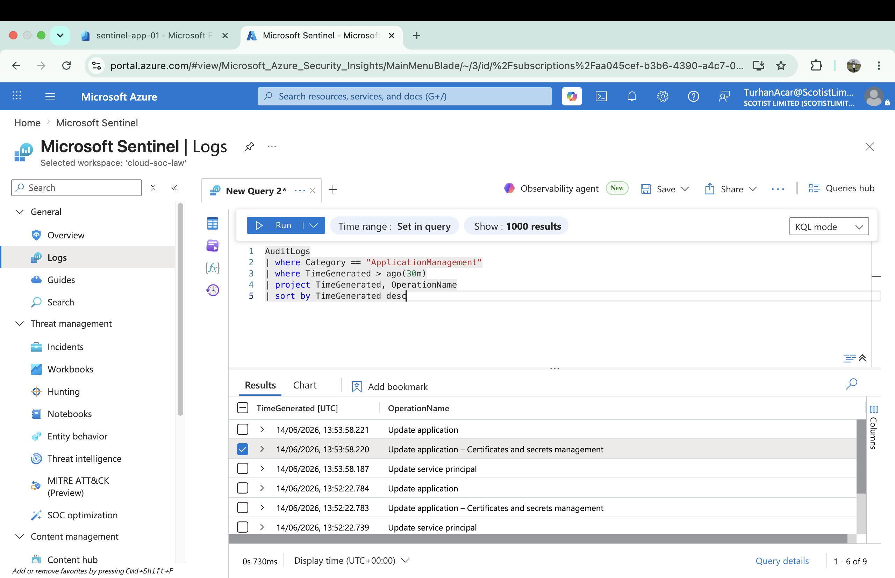

# KQL Hunting Queries

This section contains Microsoft Sentinel KQL hunting queries validated against real Microsoft Entra ID telemetry generated within the lab environment.

---

# Hunt 01 - Failed Authentication Activity

## Objective

Identify failed authentication attempts against cloud identity accounts.

## KQL Query

```kql
SigninLogs
| where ResultType != 0
| project TimeGenerated,
          UserPrincipalName,
          AppDisplayName,
          ResultType,
          ResultDescription
| sort by TimeGenerated desc
```

## Example Result

```text
ResultType: 50126
Invalid username or password
```

## MITRE ATT&CK

T1110 - Brute Force

---

# Hunt 02 - Successful Authentication Activity

## Objective

Identify successful cloud authentication activity.

## KQL Query

```kql
SigninLogs
| where ResultType == 0
| project TimeGenerated,
          UserPrincipalName,
          AppDisplayName,
          ResultType
| sort by TimeGenerated desc
```

## Example Result

```text
ResultType: 0
Successful Authentication
```

## MITRE ATT&CK

T1078 - Valid Accounts

---

# Hunt 03 - Privileged Group Ownership Changes

## Objective

Identify ownership changes involving Entra ID security groups.

## KQL Query

```kql
AuditLogs
| where OperationName == "Add owner to group"
| project TimeGenerated,
          OperationName,
          InitiatedBy,
          TargetResources
| sort by TimeGenerated desc
```

## Example Result

```text
Operation: Add owner to group
Category: GroupManagement
```

## MITRE ATT&CK

T1098 - Account Manipulation

---

# Validation Status

All hunting queries were validated against real Microsoft Sentinel telemetry generated during controlled cloud security lab exercises.
# Hunt 04 - Application Credential Changes

## Objective

Identify application and service principal modifications related to certificate and client secret management.

## Evidence



## KQL Query

```kql
AuditLogs
| where Category == "ApplicationManagement"
| where TimeGenerated > ago(30m)
| project TimeGenerated,
          OperationName
| sort by TimeGenerated desc
```

## Events Observed

```text
Update application
Update application – Certificates and secrets management
Update service principal
```

## Findings

Microsoft Sentinel successfully detected application and service principal modifications following client secret creation within Microsoft Entra ID.

The activity was visible through the AuditLogs table and identified using KQL hunting queries.

## MITRE ATT&CK Mapping

### T1098 - Account Manipulation

### T1550 - Use Alternate Authentication Material

## Validation Status

Application credential monitoring validated using real Microsoft Entra ID telemetry.
