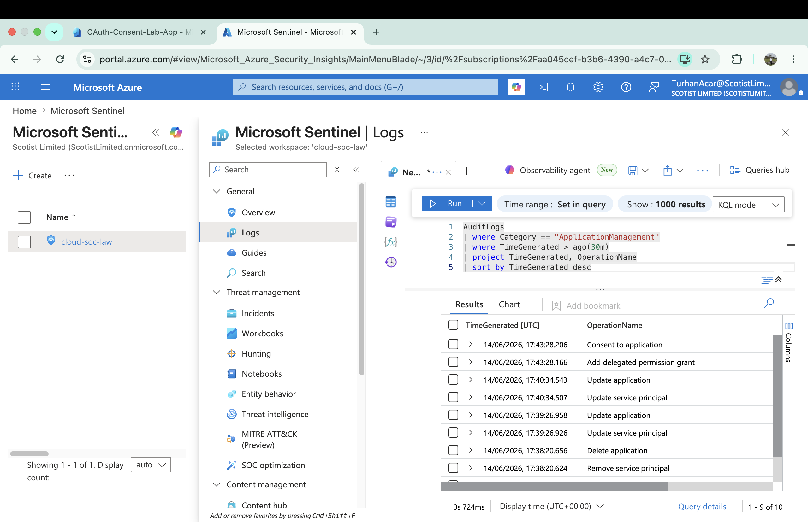

# OAuth Consent Phishing Investigation

## Scenario

An OAuth application named **OAuth-Consent-Lab-App** was registered and granted delegated Microsoft Graph permissions through Microsoft Entra ID.

OAuth consent grants can be abused by attackers to obtain access tokens and gain access to cloud resources without requiring direct credential theft.

## Investigation Objective

Identify OAuth consent activity within Microsoft Sentinel using Microsoft Entra ID Audit Logs and validate that application permission grants are visible for security monitoring and detection purposes.

## Evidence



## Data Sources

- AuditLogs
- ApplicationManagement

## Events Observed

| Time | Operation |
|--------|--------|
| 14/06/2026 17:43:28 | Consent to application |
| 14/06/2026 17:43:28 | Add delegated permission grant |
| 14/06/2026 17:40:34 | Update application |
| 14/06/2026 17:40:34 | Update service principal |
| 14/06/2026 17:39:26 | Update application |
| 14/06/2026 17:39:26 | Update service principal |
| 14/06/2026 17:37:03 | Create application – Certificates and secrets management |

## KQL Hunt

```kql
AuditLogs
| where Category == "ApplicationManagement"
| where TimeGenerated > ago(30m)
| project TimeGenerated, OperationName
| sort by TimeGenerated desc
```

## Detection Opportunity

Monitor application consent activity and delegated permission grants to identify potentially malicious OAuth applications that may have been authorized by users or administrators.

## MITRE ATT&CK Mapping

| Technique | ID |
|------------|------------|
| Steal Application Access Token | T1528 |
| Valid Accounts | T1078 |

## Outcome

Microsoft Sentinel successfully captured OAuth application consent events, delegated permission grants, application modifications, and service principal updates through AuditLogs telemetry. This investigation demonstrates how OAuth-related activity can be monitored and investigated using Microsoft Sentinel.