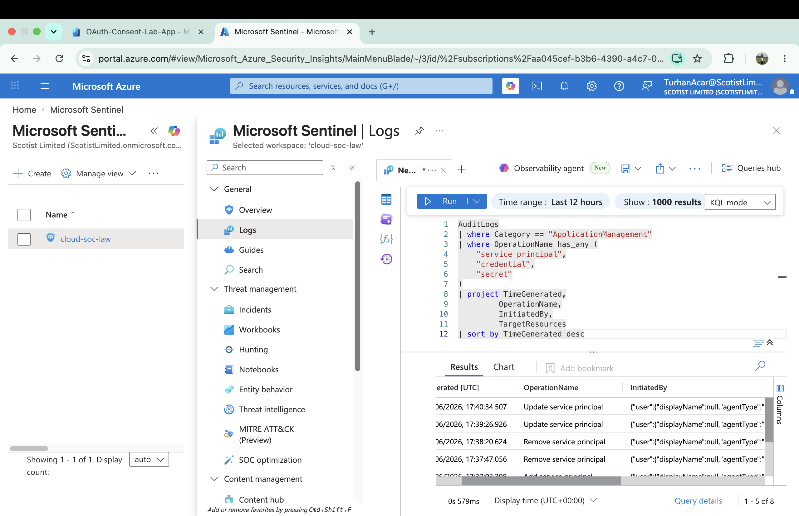

# Service Principal Abuse Investigation

## Scenario

Service principals are non-human identities used by applications and automation within Microsoft Entra ID. Attackers frequently target service principals by creating credentials, adding secrets, or abusing existing permissions to maintain persistence and access cloud resources.

## Investigation Objective

Identify service principal management activity within Microsoft Sentinel using Microsoft Entra ID Audit Logs and validate that credential-related operations are visible for security monitoring and detection.

## Evidence



## Data Sources

- AuditLogs
- ApplicationManagement

## KQL Hunt

```kql
AuditLogs
| where Category == "ApplicationManagement"
| where OperationName has_any (
    "service principal",
    "credential",
    "secret"
)
| project TimeGenerated,
         OperationName,
         InitiatedBy,
         TargetResources
| sort by TimeGenerated desc
```

## Detection Opportunity

Monitor service principal creation, credential additions, secret creation, and application modifications to identify persistence mechanisms and unauthorized cloud identity activity.

## MITRE ATT&CK Mapping

| Technique | ID |
|------------|------------|
| Account Manipulation | T1098 |
| Additional Cloud Credentials | T1098.001 |
| Cloud Accounts | T1078.004 |

## Outcome

Microsoft Sentinel successfully captured service principal management activity through AuditLogs telemetry. The investigation validates visibility into service principal and credential-related operations that could indicate persistence or privilege abuse within a cloud environment.