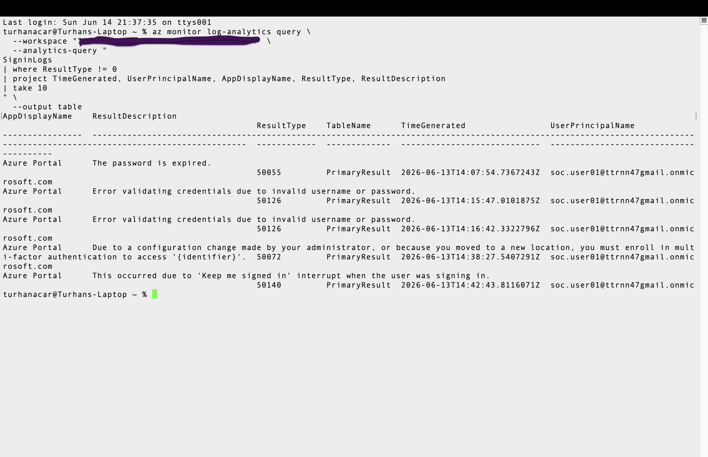

# Sentinel Log Export Pipeline

## Scenario

This investigation demonstrates a working pipeline that exports Microsoft Sentinel / Log Analytics telemetry from Azure to macOS using Azure CLI.

The pipeline queries real `SigninLogs` data and exports the results locally as JSON evidence.

## Pipeline Flow

Microsoft Sentinel / Log Analytics  
↓  
KQL Query  
↓  
Azure CLI  
↓  
macOS  
↓  
JSON Export  
↓  
GitHub Documentation  

## Evidence



## Data Source

- SigninLogs

## Workspace

- Workspace: law-cloud-soc-lab
- Resource Group: rg-cloud-soc-lab
- Workspace ID: ...............
## KQL Query

```kql
SigninLogs
| where TimeGenerated > ago(7d)
| project TimeGenerated,
         UserPrincipalName,
         AppDisplayName,
         IPAddress,
         ResultType,
         ResultDescription,
         ConditionalAccessStatus
| sort by TimeGenerated desc
```

## Export Command

```bash
az monitor log-analytics query \
  --workspace "..............." \
  --analytics-query "
SigninLogs
| where TimeGenerated > ago(7d)
| project TimeGenerated, UserPrincipalName, AppDisplayName, IPAddress, ResultType, ResultDescription, ConditionalAccessStatus
| sort by TimeGenerated desc
" \
  --output json
```

## Detection Value

This pipeline allows security analysts to export Sentinel telemetry for offline review, reporting, evidence collection, automation, and future AI-assisted incident analysis.

## Outcome

The pipeline successfully queried real Microsoft Sentinel `SigninLogs` telemetry from macOS using Azure CLI and exported the results as JSON evidence.