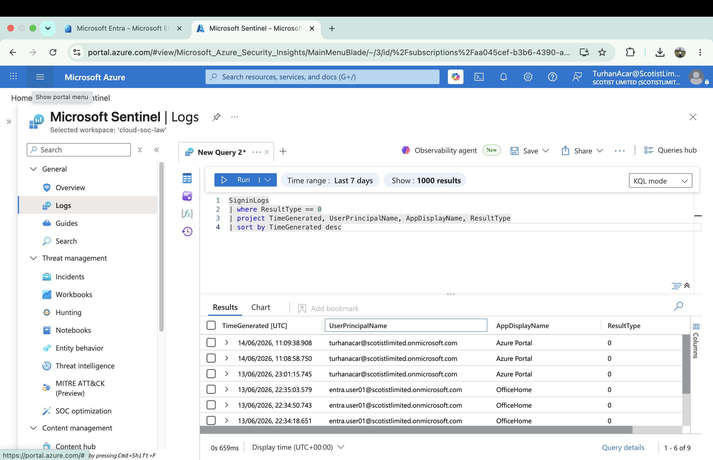
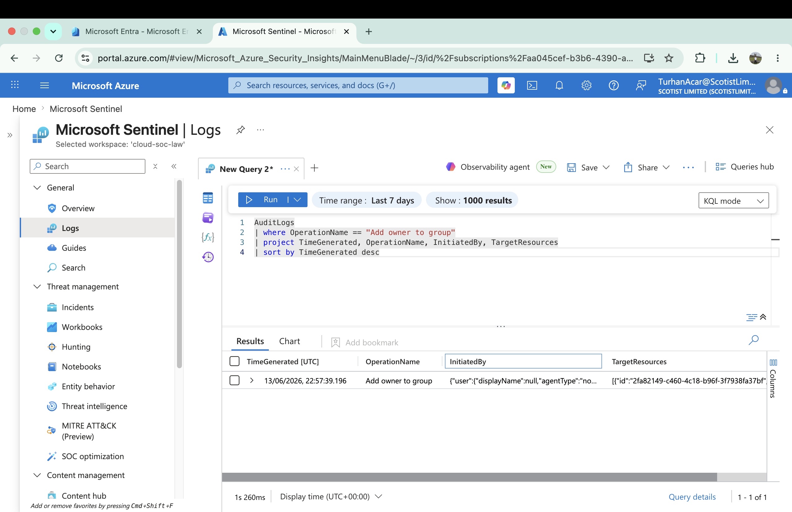

# Cloud SOC Incident Response Lab

## Overview

Cloud SOC Incident Response Lab is a hands-on Microsoft Sentinel and Microsoft Entra ID security monitoring project focused on cloud identity investigations, threat hunting, detection engineering, and security automation.

Technologies used:

- Microsoft Sentinel
- Microsoft Entra ID
- Log Analytics
- KQL
- Azure CLI
- Microsoft Defender Portal
- MITRE ATT&CK

---

## 01 Failed Authentication Investigation

Investigated failed authentication attempts using Microsoft Sentinel SigninLogs.


---

## 02 Successful Authentication Investigation

Validated successful cloud authentication events using Microsoft Sentinel.



---

## 03 Privileged Group Owner Assignment

Investigated privileged group ownership changes using Microsoft Entra ID Audit Logs.



---

## 04 KQL Hunting Queries

Developed and executed KQL hunting queries against Microsoft Sentinel telemetry.


---

## 05 Sentinel Analytics Rules

Created custom Microsoft Sentinel analytics rules to support detection engineering and automated alert generation.

---

## 06 MITRE ATT&CK Mapping

Mapped observed cloud identity activity to MITRE ATT&CK techniques including Valid Accounts, Account Manipulation, and OAuth access token abuse.

---

## 07 OAuth Consent Phishing Investigation

Investigated OAuth consent activity and delegated permission grants using Microsoft Entra ID Audit Logs.


---

## 08 Service Principal Abuse Investigation

Investigated service principal management activity and non-human identity operations using Microsoft Entra ID Audit Logs.


---

## 09 Sentinel Log Export Pipeline

Built an Azure CLI automation pipeline to query Microsoft Sentinel and export telemetry from Log Analytics to macOS.


---

## Automation Pipeline

Custom Azure CLI automation scripts:

```text
defender-pipeline/
├── export-defender-incidents.sh
└── export-failed-signins.sh
Pipeline flow:
Microsoft Sentinel
↓
Log Analytics
↓
KQL Query
↓
Azure CLI
↓
macOS
↓
JSON Export
Skills Demonstrated
Cloud Security Monitoring
SOC Investigation
Incident Response
Threat Hunting
Detection Engineering
Microsoft Sentinel
Microsoft Entra ID
KQL
Azure CLI
Security Automation
MITRE ATT&CK Mapping 
